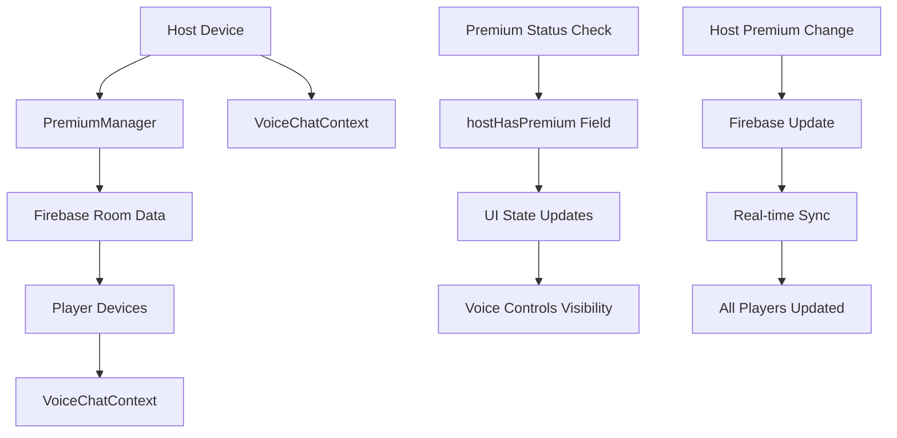

# Design Document: Host Premium Voice Chat

## Overview

This feature implements host-based premium voice chat access control for WiFi multiplayer mode. The system gates voice chat functionality based on the host's premium subscription status - when the host has premium, all players in the session can access voice chat. When the host lacks premium, voice chat is disabled for everyone with appropriate messaging.

The design leverages the existing VoiceChatContext (Agora-based) and PremiumManager (RevenueCat-based) infrastructure while adding Firebase-based premium status synchronization across all session participants.

## Architecture

### System Components



### Data Flow

1. **Host Creates Room**: PremiumManager checks host's premium status → stores in Firebase as `hostHasPremium`
2. **Players Join**: Receive `hostHasPremium` value from Firebase → update local UI state
3. **Premium Status Changes**: Host's status change → Firebase update → real-time sync to all players
4. **Voice Chat Access**: VoiceChatContext checks `hostHasPremium` before allowing channel joins

### Integration Points

- **PremiumManager**: Existing RevenueCat-based premium status checking
- **VoiceChatContext**: Existing Agora voice chat system with channel management
- **Firebase**: Real-time database for room state and premium status synchronization
- **Screen Components**: HostScreen, WifiLobbyScreen, DiscussionScreen with voice tabs

## Components and Interfaces

### Firebase Data Structure

```javascript
// Firebase path: rooms/{roomCode}
{
  status: 'lobby',
  host: 'HostName',
  hostId: 'host-id',
  hostHasPremium: boolean,  // NEW FIELD
  agoraAppId: 'stamped-app-id',
  players: {
    'player-1': { name: 'Player1', ... },
    // ...
  },
  gameState: { ... }
}
```

### Premium Status Manager Extension

```javascript
// New utility function in PremiumManager.js
export async function checkAndSyncHostPremium(roomCode, hostId) {
  try {
    const hasPremium = await checkPremiumStatus();
    await updateFirebaseHostPremium(roomCode, hasPremium);
    return hasPremium;
  } catch (error) {
    console.error('Premium sync error:', error);
    return false; // Default to no premium on error
  }
}

export async function updateFirebaseHostPremium(roomCode, hasPremium) {
  const roomRef = ref(database, `rooms/${roomCode}`);
  await update(roomRef, { hostHasPremium: hasPremium });
}
```

### Voice Chat Context Enhancement

```javascript
// Enhanced VoiceChatContext with premium gating
const VoiceChatProvider = ({ children }) => {
  const [hostHasPremium, setHostHasPremium] = useState(false);
  
  const joinChannelWithPremiumCheck = async (channelName, uid, roomCode) => {
    // Check host premium status from Firebase
    const roomRef = ref(database, `rooms/${roomCode}/hostHasPremium`);
    const snapshot = await get(roomRef);
    const hasPremium = snapshot.val() || false;
    
    if (!hasPremium) {
      throw new Error('Voice chat requires host premium');
    }
    
    return joinChannel(channelName, uid);
  };
  
  // ... rest of context
};
```

### UI Component Interfaces

#### Voice Tab Component
```javascript
const VoiceTab = ({ roomCode, playerId, hostHasPremium, onPremiumRequired }) => {
  if (!hostHasPremium) {
    return (
      <PremiumRequiredMessage 
        message="Voice chat requires the host to have premium"
        isHost={playerId === 'host-id'}
        onUpgrade={onPremiumRequired}
      />
    );
  }
  
  return <VoiceControls roomCode={roomCode} playerId={playerId} />;
};
```

#### Premium Message Component
```javascript
const PremiumRequiredMessage = ({ message, isHost, onUpgrade }) => (
  <View style={styles.premiumMessageContainer}>
    <Text style={styles.premiumMessage}>{message}</Text>
    {isHost && (
      <TouchableOpacity onPress={onUpgrade} style={styles.upgradeButton}>
        <Text style={styles.upgradeText}>UPGRADE TO PREMIUM</Text>
      </TouchableOpacity>
    )}
  </View>
);
```

## Data Models

### Room Data Model Extension

```typescript
interface Room {
  status: 'lobby' | 'game' | 'voting' | 'result';
  host: string;
  hostId: string;
  hostHasPremium: boolean;  // NEW FIELD
  agoraAppId?: string;
  players: Record<string, Player>;
  gameState?: GameState;
  createdAt: number;
}
```

### Premium Status Event Model

```typescript
interface PremiumStatusEvent {
  roomCode: string;
  hostId: string;
  previousStatus: boolean;
  newStatus: boolean;
  timestamp: number;
  source: 'initial' | 'change' | 'reconnect';
}
```

### Voice Chat State Model

```typescript
interface VoiceChatState {
  isJoined: boolean;
  isMuted: boolean;
  remoteUsers: number[];
  hostHasPremium: boolean;  // NEW FIELD
  premiumCheckError?: string;
  canJoinVoice: boolean;    // Computed from hostHasPremium
}
```

## Error Handling

### Error Categories

1. **Premium Check Failures**: Network issues, RevenueCat errors
2. **Firebase Sync Failures**: Connection issues, permission errors  
3. **Voice Chat Failures**: Agora connection issues when premium status changes
4. **Edge Case Scenarios**: Host disconnection, mid-game premium changes

### Error Handling Strategy

```javascript
// Graceful degradation with retry logic
const handlePremiumCheckError = async (error, retryCount = 0) => {
  console.error('Premium check failed:', error);
  
  if (retryCount < 3) {
    // Exponential backoff retry
    const delay = Math.pow(2, retryCount) * 1000;
    await new Promise(resolve => setTimeout(resolve, delay));
    return checkPremiumStatus(null, null, retryCount + 1);
  }
  
  // After 3 retries, default to no premium
  return false;
};

// Firebase update with error recovery
const safeUpdateHostPremium = async (roomCode, hasPremium) => {
  try {
    await updateFirebaseHostPremium(roomCode, hasPremium);
  } catch (error) {
    console.error('Firebase premium update failed:', error);
    // Queue for retry when connection restored
    queuePremiumUpdate(roomCode, hasPremium);
  }
};
```

### User-Facing Error Messages

- **Premium Check Failed**: "Unable to verify premium status. Voice chat disabled."
- **Host Premium Lost**: "Voice chat ended - host premium expired"
- **Connection Issues**: "Voice chat temporarily unavailable. Please try again."

## Testing Strategy

### Unit Testing Approach

**Focus Areas:**
- Premium status checking and caching logic
- Firebase synchronization functions
- Error handling and retry mechanisms
- UI state management for premium messages

**Key Test Cases:**
- Premium status retrieval success/failure scenarios
- Firebase update success/failure with retry logic
- Voice chat access control based on premium status
- UI component rendering based on premium state

### Property-Based Testing

Property-based tests will validate universal behaviors across all possible inputs and states, ensuring the system maintains correctness under various conditions.

**Test Configuration:**
- Minimum 100 iterations per property test
- Each test tagged with: **Feature: host-premium-voice-chat, Property {number}: {property_text}**
- Tests will use randomized room codes, player IDs, and premium status combinations

## Correctness Properties

*A property is a characteristic or behavior that should hold true across all valid executions of a system-essentially, a formal statement about what the system should do. Properties serve as the bridge between human-readable specifications and machine-verifiable correctness guarantees.*

### Property 1: Premium Status Firebase Storage

*For any* room creation with a host, the system should store the host's premium status as a boolean value at the Firebase path `rooms/{roomCode}/hostHasPremium` and update this field whenever the host's premium status changes.

**Validates: Requirements 1.1, 1.2, 10.1, 10.2, 10.3, 10.4**

### Property 2: Premium Status Synchronization

*For any* WiFi session, when the host's premium status changes, all connected players should receive the updated status and the Firebase `hostHasPremium` field should be updated accordingly.

**Validates: Requirements 1.4, 1.5, 8.1, 8.2**

### Property 3: Voice Chat Access Control

*For any* player attempting to join voice chat, access should be granted if and only if the host has premium status, and voice controls should be functional when host has premium and hidden/disabled when host lacks premium.

**Validates: Requirements 2.1, 2.2, 2.5, 2.6**

### Property 4: Premium Status Retrieval

*For any* player joining a room or viewing voice-related screens, the system should check and retrieve the host's premium status from the appropriate source (PremiumManager for host, Firebase for players).

**Validates: Requirements 1.3, 4.5, 5.1, 6.1**

### Property 5: UI State Consistency

*For any* voice tab or voice control component, the displayed interface should match the host's premium status - showing voice controls when host has premium and premium messages when host lacks premium.

**Validates: Requirements 3.1, 3.2, 4.1, 4.2, 5.2, 5.3, 6.2, 6.3**

### Property 6: Premium Message Display

*For any* situation where voice chat is unavailable due to lack of host premium, the system should display appropriate premium messages without exposing technical errors.

**Validates: Requirements 2.3, 3.2, 4.2, 5.3, 6.4, 9.3**

### Property 7: Dynamic Status Updates

*For any* change in host premium status during an active session, all UI components should update to reflect the new status and voice chat participants should be connected or disconnected accordingly.

**Validates: Requirements 3.5, 4.4, 5.5, 8.3, 8.4**

### Property 8: Host Disconnection Handling

*For any* host disconnection scenario, the system should preserve the last known premium status, continue voice chat functionality based on that status, and re-verify status upon reconnection.

**Validates: Requirements 7.1, 7.2, 7.3, 7.4, 7.5**

### Property 9: Error Handling and Fallback

*For any* premium status check failure, the system should default to no premium access, retry failed checks up to 3 times with exponential backoff, and allow the game to continue with appropriate messaging.

**Validates: Requirements 9.1, 9.2, 9.4, 9.5**

### Property 10: Voice Chat Prevention

*For any* system state where the host lacks premium, automatic voice channel joining should be prevented and manual join attempts should be blocked with appropriate messaging.

**Validates: Requirements 6.5, 2.3**

### Property 11: Data Cleanup

*For any* room deletion, all associated premium status data should be cleaned up along with other room data.

**Validates: Requirements 10.5**
