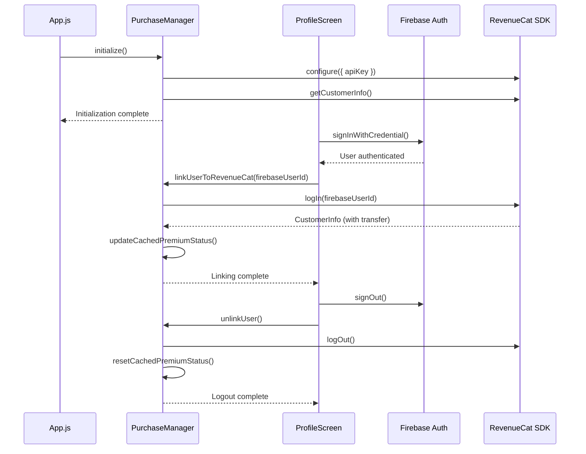

# Design Document: RevenueCat-Firebase User Linking

## Overview

This design implements persistent user identification between RevenueCat and Firebase Authentication by calling `Purchases.logIn(firebaseUserId)` after successful Google Sign-In. This enables administrators to grant premium access by email/Firebase UID, makes users visible in the RevenueCat Customer List before purchase, and ensures premium status persists across devices and app reinstalls.

The implementation modifies `PurchaseManager.js` to handle RevenueCat identity operations and updates `ProfileScreen.js` to trigger linking after authentication. The design preserves existing premium status caching behavior while adding identity synchronization at critical lifecycle points.

### Key Design Decisions

1. **Identity Linking Point**: Link RevenueCat identity immediately after Firebase authentication succeeds, before returning control to UI
2. **Transfer Behavior**: Rely on RevenueCat's built-in transfer mechanism to migrate purchases from anonymous IDs to authenticated IDs
3. **Error Handling**: Gracefully degrade to anonymous mode if linking fails, allowing app functionality to continue
4. **Logout Handling**: Call `Purchases.logOut()` before Firebase sign-out to ensure clean session termination
5. **Initialization Order**: Initialize RevenueCat SDK in `App.js` before Firebase auth state listener is registered

## Architecture

### Component Interaction Flow



### State Management

The system maintains two critical pieces of state:

1. **RevenueCat App User ID**: Stored internally by RevenueCat SDK
   - Initially: Anonymous UUID generated by SDK
   - After linking: Firebase User ID
   - After logout: New anonymous UUID

2. **Cached Premium Status**: Stored in `PurchaseManager.isPro`
   - Updated after successful `logIn()` call
   - Updated by background refresh (every 60 seconds)
   - Reset to false on `logOut()`

## Components and Interfaces

### PurchaseManager Modifications

#### New Methods

```javascript
/**
 * Links RevenueCat customer to Firebase user ID
 * @param {string} firebaseUserId - Firebase UID from auth.currentUser.uid
 * @returns {Promise<boolean>} - True if linking succeeded, false otherwise
 */
async linkUserToRevenueCat(firebaseUserId)

/**
 * Unlinks RevenueCat customer (logout)
 * @returns {Promise<void>}
 */
async unlinkUser()
```

#### Modified Methods

```javascript
/**
 * Initialize RevenueCat SDK
 * - Configures SDK with platform-specific API key
 * - Performs initial premium status check
 * - Starts background refresh interval
 * - NEW: Does NOT link to Firebase (handled separately)
 */
async initialize()
```

### ProfileScreen Modifications

#### Sign-In Flow

```javascript
const handleGoogleSignIn = async () => {
    // 1. Existing: Google Sign-In
    const userInfo = await GoogleSignin.signIn();
    const credential = GoogleAuthProvider.credential(idToken);
    const userCredential = await signInWithCredential(auth, credential);
    
    // 2. NEW: Link RevenueCat to Firebase User
    await PurchaseManager.linkUserToRevenueCat(userCredential.user.uid);
    
    // 3. Existing: Save profile to Firestore
    await setDoc(doc(db, "users", user.uid), userProfile, { merge: true });
    
    // 4. Existing: Update UI state
    setUser(user);
    setDisplayName(newDisplayName);
}
```

#### Sign-Out Flow

```javascript
const handleSignOut = async () => {
    // 1. NEW: Unlink RevenueCat
    await PurchaseManager.unlinkUser();
    
    // 2. Existing: Google Sign-Out
    await GoogleSignin.signOut();
    
    // 3. Existing: Firebase Sign-Out
    await signOut(auth);
    
    // 4. Existing: Reset UI state
    setUser(null);
    setDisplayName('');
}
```

### App.js Modifications

No changes required. RevenueCat initialization already occurs in `useEffect` before navigation is ready, ensuring SDK is configured before any authentication state changes.

## Data Models

### RevenueCat Customer Record

After linking, the RevenueCat customer record will contain:

```javascript
{
  app_user_id: "firebase_uid_abc123",  // Firebase UID
  email: "user@example.com",           // From Firebase Auth
  entitlements: {
    active: {
      premium: {
        identifier: "premium",
        isActive: true,
        expirationDate: "2024-12-31T23:59:59Z"
      }
    }
  },
  originalAppUserId: "$RCAnonymousID:abc123",  // Original anonymous ID (if transferred)
  firstSeen: "2024-01-01T00:00:00Z",
  lastSeen: "2024-01-15T12:00:00Z"
}
```

### PurchaseManager State

```javascript
{
  isPro: boolean,                    // Cached premium status
  expirationDate: string | null,     // Premium expiration (for UI display)
  listeners: Array<Function>,        // Premium status change callbacks
  refreshInterval: NodeJS.Timeout    // Background refresh timer
}
```


## Correctness Properties

*A property is a characteristic or behavior that should hold true across all valid executions of a system—essentially, a formal statement about what the system should do. Properties serve as the bridge between human-readable specifications and machine-verifiable correctness guarantees.*

### Property 1: RevenueCat Login Called with Firebase UID

*For any* valid Firebase User ID, when `linkUserToRevenueCat(firebaseUserId)` is called, the system SHALL call `Purchases.logIn(firebaseUserId)` with that exact Firebase UID.

**Validates: Requirements 1.1, 4.1**

### Property 2: Premium Status Updated After Successful Login

*For any* customer info returned by `Purchases.logIn()`, when the login succeeds, the cached premium status (`isPro`) SHALL match the presence of an active "premium" entitlement in that customer info.

**Validates: Requirements 1.2, 6.2**

### Property 3: Login Errors Do Not Block Execution

*For any* error thrown by `Purchases.logIn()`, when `linkUserToRevenueCat()` is called, the method SHALL catch the error, log it, and resolve successfully without throwing.

**Validates: Requirements 1.3, 7.2**

### Property 4: Login Completes Before Promise Resolution

*For any* Firebase User ID, when `linkUserToRevenueCat(firebaseUserId)` is called, the returned promise SHALL NOT resolve until after the `Purchases.logIn()` call has completed (either successfully or with error).

**Validates: Requirements 1.4**

### Property 5: Configure Called During Initialization

*For any* platform (iOS or Android), when `initialize()` is called, the system SHALL call `Purchases.configure()` with the platform-specific API key.

**Validates: Requirements 2.1, 2.4**

### Property 6: Initialization Errors Do Not Crash App

*For any* error thrown by `Purchases.configure()`, when `initialize()` is called, the method SHALL catch the error, log it, and complete without throwing.

**Validates: Requirements 2.3**

### Property 7: Logout Calls RevenueCat Logout

*For any* call to `unlinkUser()`, the system SHALL call `Purchases.logOut()`.

**Validates: Requirements 3.1, 4.2**

### Property 8: Premium Status Reset After Logout

*For any* state of the system, when `unlinkUser()` completes successfully, the cached premium status (`isPro`) SHALL be false.

**Validates: Requirements 3.2**

### Property 9: Logout Errors Do Not Block Execution

*For any* error thrown by `Purchases.logOut()`, when `unlinkUser()` is called, the method SHALL catch the error, log it, and resolve successfully without throwing.

**Validates: Requirements 3.4**

### Property 10: Concurrent Operations Handled Safely

*For any* sequence of rapid calls to `linkUserToRevenueCat()` and `unlinkUser()`, the system SHALL complete all operations without throwing errors or entering inconsistent state.

**Validates: Requirements 4.4**

### Property 11: Login Operations Logged

*For any* Firebase User ID, when `linkUserToRevenueCat(firebaseUserId)` is called, the system SHALL log the Firebase User ID being linked.

**Validates: Requirements 8.1**

### Property 12: Logout Operations Logged

*For any* call to `unlinkUser()`, the system SHALL log the logout operation.

**Validates: Requirements 8.2**

### Property 13: Transfer Information Logged

*For any* customer info returned by `Purchases.logIn()` that contains transfer information (originalAppUserId), the system SHALL log the transfer from the original anonymous ID to the Firebase User ID.

**Validates: Requirements 8.3**

### Property 14: Errors Logged with Details

*For any* error thrown by RevenueCat identity operations (`logIn` or `logOut`), the system SHALL log the error with full error details.

**Validates: Requirements 8.4**

## Error Handling

### Error Categories

1. **Network Errors**: RevenueCat API calls may fail due to network connectivity
   - Strategy: Catch and log, allow app to continue with cached status
   - Recovery: Background refresh will retry on next interval (60 seconds)

2. **SDK Configuration Errors**: RevenueCat SDK may fail to initialize
   - Strategy: Catch and log, allow app to continue in anonymous mode
   - Recovery: User can restart app to retry initialization

3. **Authentication Errors**: RevenueCat login may fail due to invalid user ID or SDK state
   - Strategy: Catch and log, continue with anonymous mode
   - Recovery: User can sign out and sign in again to retry

### Error Handling Patterns

```javascript
// Pattern 1: Non-blocking async operations
async linkUserToRevenueCat(firebaseUserId) {
    try {
        console.log('🔗 Linking RevenueCat to Firebase UID:', firebaseUserId);
        const customerInfo = await Purchases.logIn(firebaseUserId);
        
        // Update cached status
        const premiumEntitlement = customerInfo.entitlements.active['premium'];
        this.setProStatus(!!premiumEntitlement);
        
        // Log transfer if occurred
        if (customerInfo.originalAppUserId) {
            console.log('📦 Transfer:', customerInfo.originalAppUserId, '->', firebaseUserId);
        }
        
        return true;
    } catch (error) {
        console.error('❌ RevenueCat login failed:', error);
        // Don't throw - allow app to continue
        return false;
    }
}

// Pattern 2: Graceful degradation
async initialize() {
    try {
        if (Platform.OS === 'ios') {
            await Purchases.configure({ apiKey: API_KEYS.apple });
        } else if (Platform.OS === 'android') {
            await Purchases.configure({ apiKey: API_KEYS.google });
        }
        
        await this.checkProStatus();
        this.startBackgroundRefresh();
    } catch (error) {
        console.error('❌ PurchaseManager Init Error:', error);
        // App continues in anonymous mode
    }
}
```

### Error Recovery Mechanisms

1. **Background Refresh**: Existing 60-second interval will retry failed operations
2. **App Restart**: User can restart app to retry initialization
3. **Manual Retry**: User can sign out and sign in again to retry linking
4. **Cached Status**: App uses last known premium status when API calls fail

## Testing Strategy

### Dual Testing Approach

This feature requires both unit tests and property-based tests to ensure comprehensive coverage:

- **Unit tests**: Verify specific examples, edge cases, and error conditions
- **Property tests**: Verify universal properties across all inputs

Together, these approaches provide comprehensive coverage where unit tests catch concrete bugs and property tests verify general correctness.

### Unit Testing

Unit tests will focus on:

1. **Specific Examples**:
   - Successful login with a known Firebase UID
   - Successful logout
   - Initialization with iOS platform
   - Initialization with Android platform

2. **Edge Cases**:
   - Login with empty string Firebase UID
   - Login with null Firebase UID
   - Multiple rapid login calls
   - Login followed immediately by logout

3. **Error Conditions**:
   - RevenueCat SDK throws network error during login
   - RevenueCat SDK throws error during initialization
   - RevenueCat SDK throws error during logout

4. **Integration Points**:
   - Verify login updates cached premium status
   - Verify logout resets cached premium status
   - Verify listeners are notified of status changes

### Property-Based Testing

Property tests will use **fast-check** (JavaScript property-based testing library) with minimum 100 iterations per test.

Each property test will be tagged with a comment referencing the design property:

```javascript
// Feature: revenucat-firebase-user-linking, Property 1: RevenueCat Login Called with Firebase UID
test('property: login called with Firebase UID', async () => {
    await fc.assert(
        fc.asyncProperty(fc.string(), async (firebaseUserId) => {
            // Test implementation
        }),
        { numRuns: 100 }
    );
});
```

#### Property Test Coverage

1. **Property 1-4**: Login behavior
   - Generate random Firebase UIDs
   - Verify `Purchases.logIn()` called with correct UID
   - Verify premium status updated correctly
   - Verify errors handled gracefully
   - Verify async completion order

2. **Property 5-6**: Initialization behavior
   - Test both iOS and Android platforms
   - Verify correct API key used
   - Verify errors don't crash app

3. **Property 7-9**: Logout behavior
   - Verify `Purchases.logOut()` called
   - Verify premium status reset
   - Verify errors handled gracefully

4. **Property 10**: Concurrency
   - Generate random sequences of login/logout calls
   - Verify no crashes or inconsistent state

5. **Property 11-14**: Logging behavior
   - Verify all operations logged
   - Verify errors logged with details
   - Verify transfer information logged

### Test Configuration

- **Library**: fast-check (npm package)
- **Iterations**: 100 per property test
- **Mocking**: Mock `react-native-purchases` SDK for all tests
- **Assertions**: Jest matchers for verification

### Testing Notes

- Mock the RevenueCat SDK (`react-native-purchases`) to avoid real API calls
- Use Jest's `jest.spyOn()` to verify SDK methods are called correctly
- Test both success and failure paths for all async operations
- Verify logging output using `console.log` spies
- Test concurrency using Promise.all() with rapid calls

